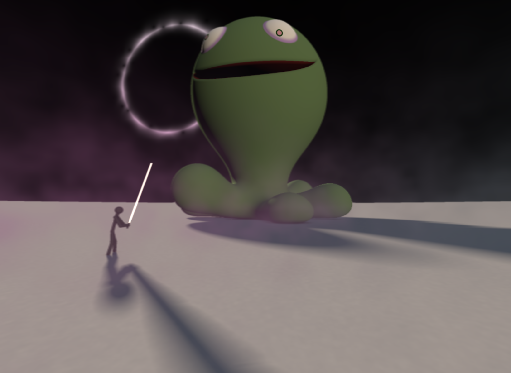

# CIS 566 Homework 3: Environment Setpiece

## Overview

Matthew Riley\
PennKey: matriley\
Live at: https://mgriley.github.io/hw03-environment-setpiece/

Please note: The scene renders as intended on my Mac laptop and a Mac desktop, but not on the one Windows desktop that I happended to try (in which case the monster is red-bodied and mouth-less). I'm unsure what causes this.

## Techniques:

* Animation: the light at the rim of the eclipse and the the fog density are slowly varied
* Noise:
  - The flares of the eclipse are made using voronoi noise that is weighted to only appear on the sun's radius (in a crude attempt to simulate lens flare at the rim of the planet)
  - The slight variation of the ground color is made by randomly perturbing the surface normals
  - The fog density is weighted by a function of the ray direction. This varies the otherwise plain distance fog density.
* Remapping of [0, 1] to a set of colors: not done
* Toolbox functions: smoothstep is used frequently
* Lighting: three light sources are used, in the same style as Inigo Quilez's "Outdoors Lighting" article.
* Penumbra shadows: as seen on the monster and warrior
* Ambient Occulsion: using the 5-tap method. Can be seen under the monster's feet.
* SDF Blending: the monster is modeled using blended SDFs (see the monster_sdf function in flat-frag.glsl). The mouth, in particular, is the intersection of two ellipses, which is carved out of the head using a difference operation. The warrior (see the person_sdf function) is also modeled this way, using many capsules. 
* Anti-aliasing: the screenshot was taken of the scene rendered with AA on, but it is left off by default to permit a reasonable frame rate
* Post-processing: a depth-of-field effect is applied, where the monster's head is near the focal point. The rendering passes are implemented in OpenGLRenderer.ts. There is no dedicated bloom effect, but very high color values will leak on to nearby pixels in the process of averaging. This effect can be seen on the warrior's sword/light-saber.

## Sources

https://www.iquilezles.org/www/material/nvscene2008/rwwtt.pdf
https://www.iquilezles.org/www/articles/normalsSDF/normalsSDF.htm
https://www.iquilezles.org/www/articles/smin/smin.htm
https://www.iquilezles.org/www/articles/raymarchingdf/raymarchingdf.htm
https://www.iquilezles.org/www/articles/sdfmodeling/sdfmodeling.htm
http://iquilezles.org/www/articles/distfunctions2d/distfunctions2d.htm
https://www.iquilezles.org/www/articles/functions/functions.htm
http://iquilezles.org/www/articles/outdoorslighting/outdoorslighting.htm
http://iquilezles.org/www/articles/rmshadows/rmshadows.htm
http://iquilezles.org/www/articles/fog/fog.htm
https://www.shadertoy.com/view/4tByz3
https://www.shadertoy.com/view/Xds3zN

